# 🛠 BOOKING_P3 - Tool Booking System

Welcome to my **Tool Booking Web App**, a Django-based system that allows users to browse, view details, and book available tools. The app is deployed on **Heroku** and uses **Cloudinary** for image hosting.

[View the live project here.](https://booking-p3-app-7f9131a4bc0e.herokuapp.com/)

---

## Table of Contents

- [🛠 BOOKING_P3 - Tool Booking System](#-booking_p3---tool-booking-system)
- [User Experience (UX)](#user-experience-ux)
  - [Project Goals](#project-goals)
  - [Strategy](#strategy)
  - [User Stories](#user-stories)
- [Features](#features)
  - [Existing Features](#existing-features)
    - [Navigation Bar](#navigation-bar)
    - [Home Page](#home-page)
    - [Tool Page](#tool-page)
    - [Booking Page](#booking-page)
    - [User Bookings Dashboard](#user-bookings-dashboard)
    - [Register Page](#register-page)
    - [Login Page](#login-page)
    - [Logout Page](#logout-page)
    - [Django Admin Panel](#django-admin-panel)
    - [System Messages](#system-messages)
    - [Footer](#footer)
    - [Additional Features](#additional-features)
  - [Features to Implement in the Future](#features-to-implement-in-the-future)
- [Design](#design)
  - [Wireframes](#wireframes)
  - [Data Model](#data-model)
  - [Site Map](#site-map)
  - [Colours](#colours)
  - [Typography](#typography)
  - [Imagery](#imagery)
- [Technologies Used](#technologies-used)
  - [Languages Used](#languages-used)
  - [Frameworks and Libraries Used](#frameworks-and-libraries-used)
  - [Software and Web Applications Used](#software-and-web-applications-used)
- [Testing](#testing)
- [CRUD Functionality](#crud-functionality)
- [Deployment](#deployment)
- [Note on Removed Files](#note-on-removed-files)
- [Project Requirements Checklist](#project-requirements-checklist)
- [Credits](#credits)
  - [Code](#code)
  - [Acknowledgements](#acknowledgements)

---

## User Experience (UX)

### Project Goals

The goal of `booking_p3` is to develop a user-friendly tool rental platform that enables individuals and businesses to conveniently rent tools on a short-term basis.

Users can:

- Browse a wide range of tools available for rent.
- View detailed descriptions, images, and availability.
- Register and securely log into their accounts.
- Book tools by selecting appropriate dates and times.
- Manage their bookings including modifications and cancellations.
- Receive timely notifications about their booking status.

Administrators can:

- Manage tool listings by adding, updating, or deleting entries.
- View and oversee all bookings via the Django admin panel.

This project uses Django for backend logic, PostgreSQL for production database management on Heroku, and Cloudinary for scalable image hosting.

---

### Strategy

The application targets:

- Homeowners needing tools for personal projects without buying them.
- Freelancers and small businesses needing occasional access to specialized equipment.
- Local communities looking for a cost-effective rental solution.

The design emphasizes:

- Intuitive navigation with clear calls to action.
- A seamless booking process with validation checks.
- Responsive design for desktop and mobile users.
- Secure user authentication and administration.

---

### User Stories

- **As a visitor**, I want to browse available tools so that I can decide what to rent.
- **As a registered user**, I want to book tools for specific dates so that I can plan my projects.
- **As a registered user**, I want to manage my bookings so I can update or cancel if plans change.
- **As an admin**, I want to manage the inventory and bookings to keep the service running smoothly.

---

## Features

### Existing Features

#### Navigation Bar

- Fixed, responsive navigation on all pages.
- Dynamic links depending on authentication:

  - **When not logged in**:
    - Home
    - New Booking
    - Tools
    - Login
    - Register

  

  *Navigation bar for non-authenticated users*

  - **When logged in**:
    - Home
    - New Booking
    - Tools
    - Welcome message with user email
    - Logout

  

---

#### Home Page

- Welcoming introduction to the rental service.
- Highlights featured tools and promotions.

---

#### Tool Page

- Grid display of all available tools with images.
- Each card includes tool details and booking options.

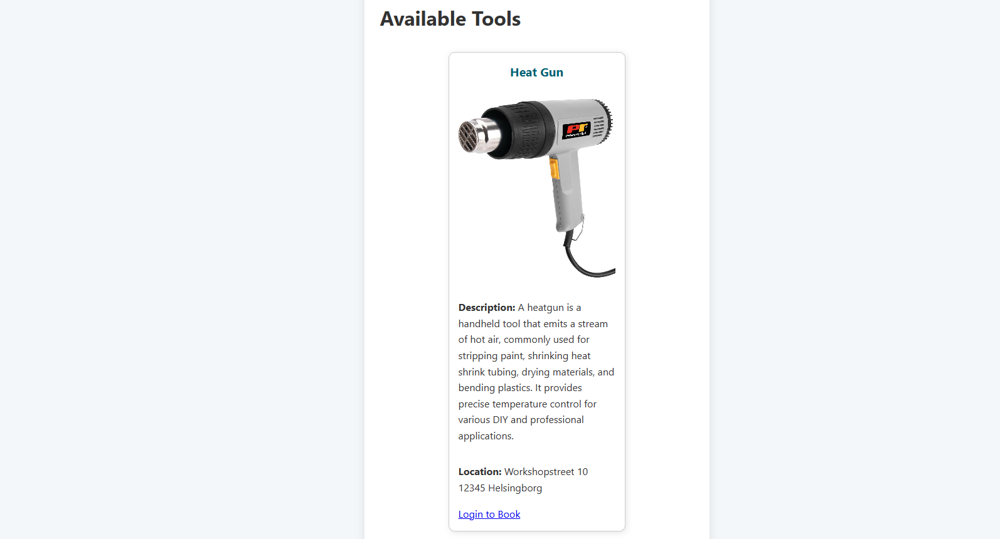

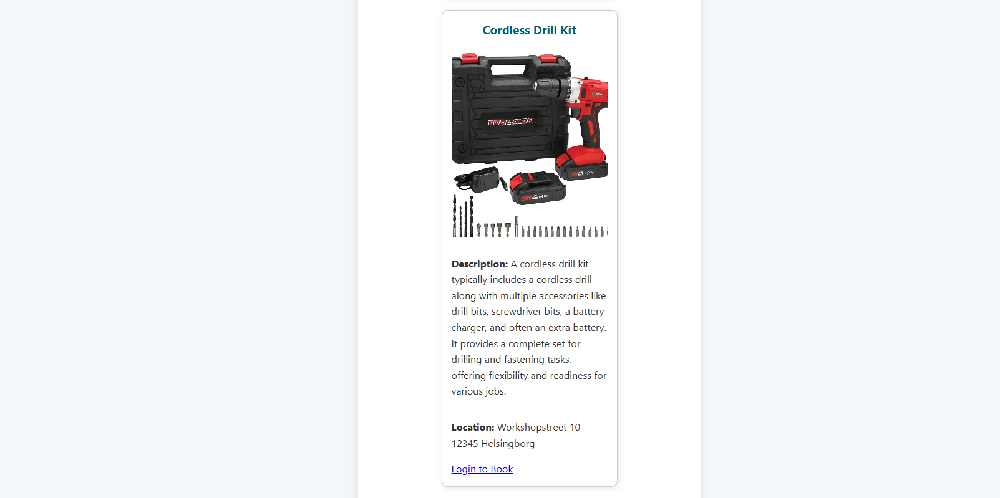

---

#### Booking Page

Logged-in users can book tools in **two ways**:

1. **New Booking (Generic Tool Selection):**
   - View all available tools.
   - Choose date and time with an interactive calendar.
   - System checks availability to prevent double-booking.

2. **Tool-Specific Booking:**
   - Browse the "Tools" tab.
   - Click the “Book Now” button on the chosen tool’s card.

After booking, users receive an on-screen confirmation.  
Optional **email** confirmation is also available.  
Unauthenticated users are redirected to the login page.

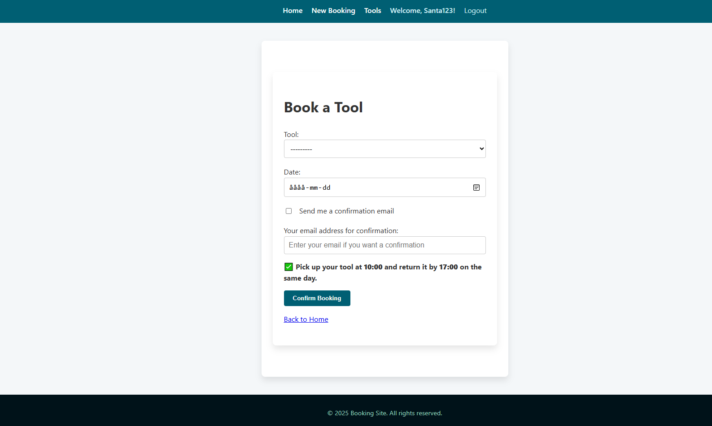

---

#### User Bookings Dashboard

- List of active and past bookings.
- Options to modify or cancel existing bookings.

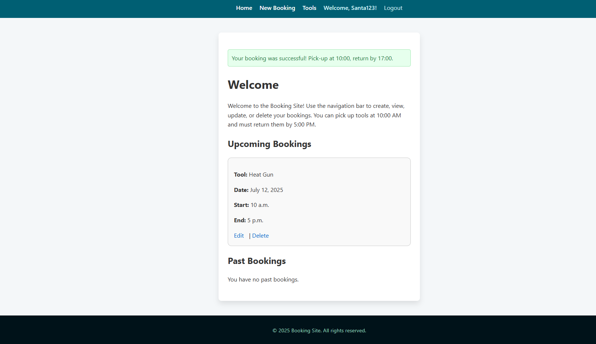

---

#### Register Page

- User registration with form validation and error feedback.

---

#### Login Page

- Secure login with session management.

---

#### Logout Page

- Logs users out securely and redirects appropriately.

---

#### Django Admin Panel

- Admin interface for managing tools, bookings, and users.

---

#### System Messages

- Flash messages clearly indicate **success** (green) or **error** (red) to users for actions like booking confirmation, login errors, or form validation.

---

#### Footer

- Minimal, consistent footer displayed across all pages.

---

#### Additional Features

- **Authentication Redirects:** Unauthorized access redirects users to the login page.
- **Email Confirmations:** Sent on booking creation or deletion.
- **Custom Error Pages:** Branded 404 and 500 error pages.

---

### Features to Implement in the Future

- **Tool Filtering:** By category, price, or availability.
- **Rental Pricing:** Dynamic fees based on duration.
- **User Reviews & Ratings:** Build trust with user feedback.
- **Payment Integration:** Secure online checkout.
- **Pickup Locations:** Multiple pickup spots or lockers.
- **Barcode Scanning:** Faster check-in/checkout.
- **Direct Email Login:** Passwordless "magic link" logins.

---

## Design

The design prioritizes simplicity, clarity, and user accessibility, ensuring users can find and book tools easily on any device.

---

### Wireframes

Wireframes were created early to map layouts for Home, Tool Listings, Booking Forms, and Dashboards, ensuring consistent UX.

---

### Data Model

Built with Django models to support:

- User authentication.
- Tool catalog with images.
- Bookings tied to tools and users, with availability validation.

**Models:**
- `Tool`: Name, description, image, availability.
- `Booking`: Date/time, user, linked tool.
- `User`: Default Django auth system.

---

### Site Map

- **Home:** Intro and featured tools.
- **Tools:** Browse tools, with "Book Now".
- **New Booking:** Choose tool and date.
- **Dashboard:** View, edit, or cancel bookings.
- **Auth Pages:** Login, Register, Logout.
- **Admin Panel:** Admin-only management.

---

### Colours

To match the natural, tool-rental theme, a warm, earthy palette was chosen. Greens and browns suggest reliability and practicality without being distracting.

**Focus on accessibility and contrast:**

- **Background:** Soft warm beige (#fdf6f0).
- **Primary Action Buttons:** Deep green (#386641) for confirming bookings.
- **Secondary / Cancel Buttons:** Rich brown (#bc6c25).
- **Navigation and Footer:** Dark forest green (#264653).
- **Text:** Dark gray / near-black (#333) for readability.
- **Highlights / Alerts:** Warm yellow/orange for important messages.
- **System Messages:** Green for success, red for errors.

---

### Typography

Clear, accessible fonts with bold headings for hierarchy and legible body text. Default web-safe fonts ensure consistent rendering.

---

### Imagery

All tools feature clear, relevant images hosted on Cloudinary, making selection easy and visually appealing.

---

## Technologies Used

### Languages Used
- **Python:** Backend development with Django.
- **HTML5:** Page structure.
- **CSS3:** Styling and responsiveness.
- **JavaScript:** Enhancing interactivity.

---

### Frameworks and Libraries Used
- **Django:** High-level Python web framework.
- **Bootstrap 5:** Responsive, modern UI.
- **Cloudinary:** Image hosting and management.
- **dj-database-url:** Simplifies Heroku DB config.
- **django-heroku:** Prepares Django for Heroku.
- **WhiteNoise:** Efficient static file serving.
- **PostgreSQL:** Production-grade database on Heroku.

---

### Software and Web Applications Used
- **Visual Studio Code:** Primary IDE.
- **Git and GitHub:** Version control and repo hosting.
- **Heroku:** Deployment platform.
- **Postman:** API testing.
- **Figma / Pencil and Paper:** Wireframing and UI planning.

---
---

## Testing

### Browser Testing

| Browser         | Tested Version | Status |
|-----------------|----------------|--------|
| Google Chrome   | 125+           | ✅ |
| Mozilla Firefox | 115+           | ✅ |
| Microsoft Edge  | 125+           | ✅ |
| Safari (iOS)    | iOS 16+        | ✅ |
| Safari (macOS)  | 16+            | ✅ |
| Android Chrome  | 125+           | ✅ |

---

### ✅ Functional Testing Overview

| Feature                            | Test Case Description                                 | Expected Result                        | Status |
|------------------------------------|-------------------------------------------------------|----------------------------------------|--------|
| **Register Form**                  | Valid input                                           | Redirect to login                      | ✅ |
| **Register Form**                  | Password mismatch or invalid email                    | Show error message                     | ✅ |
| **Login Form**                     | Valid credentials                                     | Redirect to bookings dashboard         | ✅ |
| **Login Form**                     | Invalid credentials                                   | Show "invalid login" error             | ✅ |
| **Booking Form**                   | All fields valid                                      | Booking is created                     | ✅ |
| **Booking Form**                   | Missing required field                                | Form shows validation error            | ✅ |
| **Editing Booking**                | Access edit page while logged in                      | Edit form is shown                     | ✅ |
| **Unauthorized Access**            | Visit booking page while logged out                   | Redirect to login                      | ✅ |
| **Navigation Links**               | Click Home, Tools, New Booking, Logout, etc.          | Navigate to correct pages              | ✅ |
| **Email Confirmations**            | Booking/deletion triggers email                       | Email received (if address provided)   | ✅ |
| **Flash Messages**                 | Perform booking or login                              | Shows green success or red error       | ✅ |

---

### ✅ Manual Testing

- ✅ Login/logout tested on desktop and mobile.
- ✅ Booking CRUD tested for edge cases.
- ✅ Email confirmations verified (where configured).
- ✅ Validation errors shown correctly.
- ✅ 404 and 500 error pages manually confirmed.

---

### Validator Testing

#### W3C Markup Validator
- HTML passes validation for semantic and accessible markup.

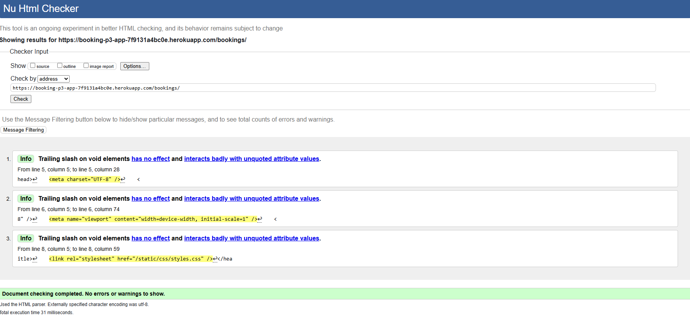

#### W3C CSS Validator
- CSS validated for syntax and best practices.

#### JSHint
- ⚠️ Notes: Reports expected ES6 usage warnings.

#### PEP8 Online
- Python code follows PEP8 style guidelines for readability and consistency.

admin.py

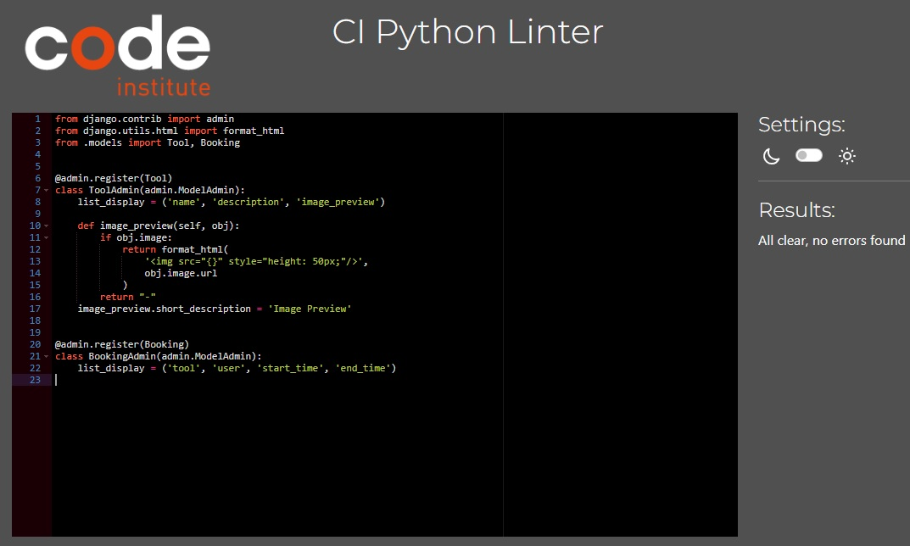

forms.py

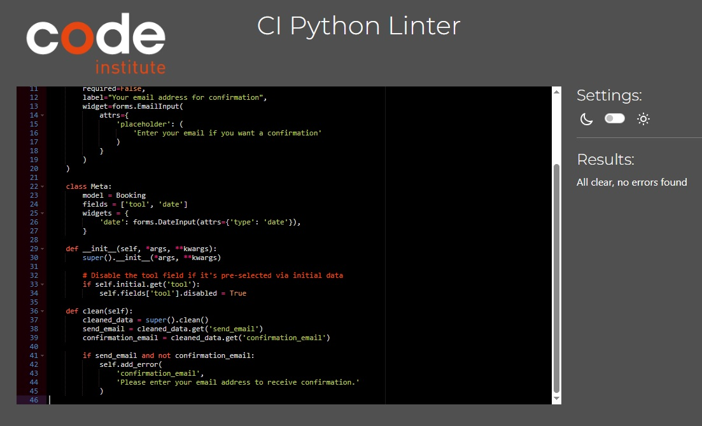

models.py

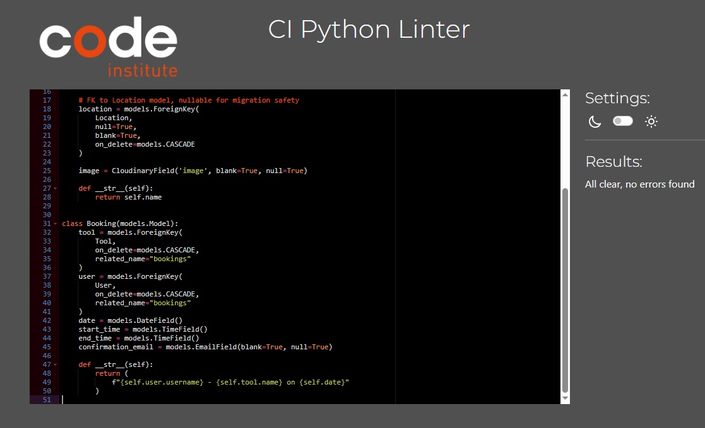

urls.py

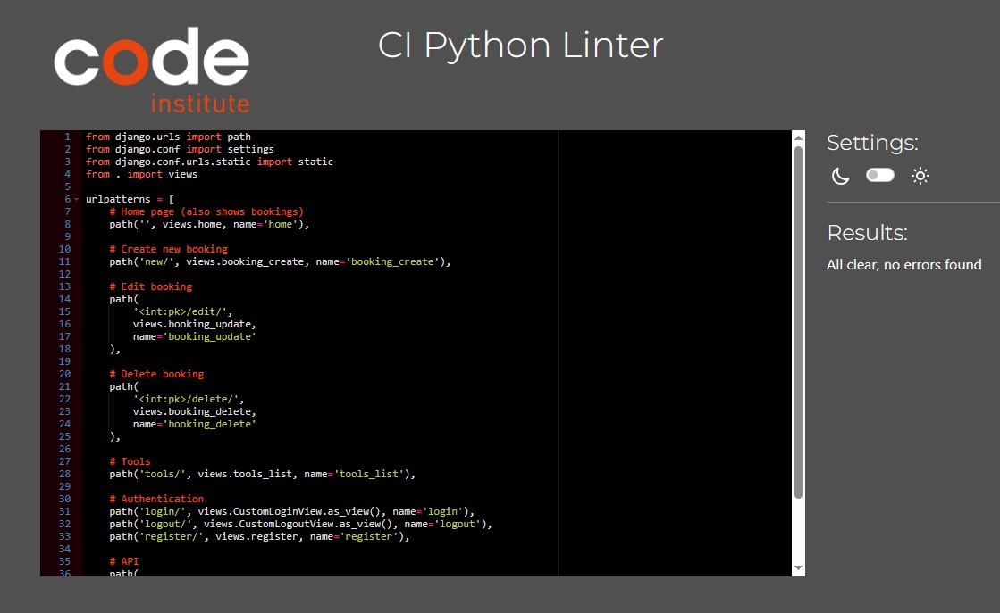

views.py

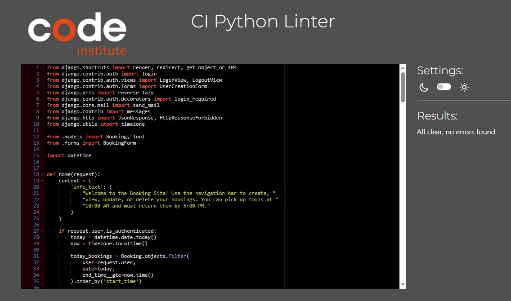

#### Lighthouse
- Audited for performance, accessibility, SEO, and best practices with improvements applied.

---

### Automated Testing

#### Django Testing Tools
- Unit and integration tests written using Django’s testing framework.
- Tests for models, forms, and views validate booking logic and authentication flows.

---

### User Stories Testing
- Each user story was tested to ensure all acceptance criteria were met.

---

### Further Testing
- Manual exploratory testing for edge cases.
- Peer feedback incorporated to improve UX and fix bugs.

---

### Solved Bugs
- Double-booking validation corrected.
- Fixed layout glitches on mobile.
- Improved user session handling after logout.

---

### Known Bugs
- Minor UI alignment issues on very small screens.
- Possible short delay on Heroku dyno cold start.

---

## CRUD Functionality

This app implements full CRUD (Create, Read, Update, Delete) operations:

- **Create**: Users submit a reservation form choosing tool, date, and time. The system validates and stores the booking.
- **Read**: Users view all their bookings in a dashboard.
- **Update**: Users can edit existing bookings with conflict checks.
- **Delete**: Users can cancel bookings, freeing up slots for others.

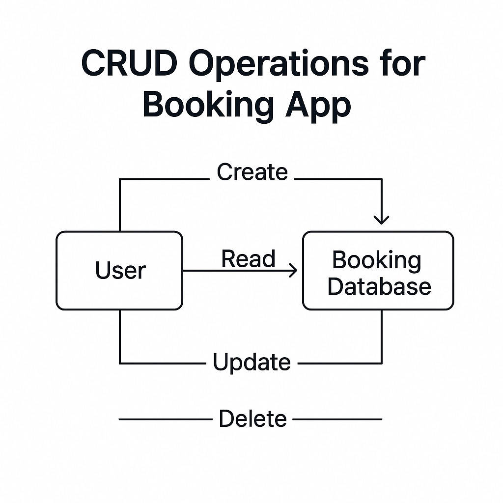

---

## Deployment

The app is deployed on Heroku with continuous integration from GitHub.

**Deployment Steps:**

1. Push code to GitHub.
2. Connect repo to Heroku app.
3. Set environment variables on Heroku (SECRET_KEY, CLOUDINARY keys, EMAIL credentials).
4. Deploy using Heroku Git/GitHub integration.
5. Run `migrate` and `collectstatic` via Heroku console.

---

## Note on Removed Files

- **Security and Cleanliness**: `.env` and unnecessary local files removed from the repository.
- **Sensitive Variables**: Managed securely using Heroku Config Vars.
- **Ignored Files**: Local media/static and editor settings excluded via `.gitignore`.
- **Local Setup**: Developers should create their own `.env` with required settings.

---

## ✅ Project Requirements Checklist

| Requirement                              | Status     | Explanation                                                    |
|------------------------------------------|------------|----------------------------------------------------------------|
| **Relational DB (PostgreSQL)**           | ✅ Done    | Deployed on Heroku using PostgreSQL.                          |
| **CRUD Functionality**                   | ✅ Done    | Users can Create, Read, Update, and Delete bookings.          |
| **User Authentication**                  | ✅ Done    | Login, logout, registration, and session management included. |
| **Navigation & Layout**                  | ✅ Done    | Responsive navbar and accessible navigation.                   |
| **Custom HTML/CSS**                      | ✅ Done    | Custom templates and styling.                                  |
| **README and Documentation**             | ✅ Complete| Detailed README covering all project aspects.                  |
| **Git & GitHub Usage**                   | ✅ Complete| Managed with Git, pushed to GitHub with structured commits.    |
| **Proper Attribution**                   | ✅ Done    | Credits given for external assets or code.                     |
| **Responsive Design (down to 270px)**    | ✅ Done    | Fully tested on small devices (e.g., iPhone SE, Galaxy A).     |
| **Google Calendar Sync & Deletion**      | ✅ Working | Events sync and deletion reflected in Google Calendar.         |
| **Form Validation & Code Linting**       | ✅ Passed  | Django form validation and linting (PEP8, JSHint) passed.      |
| **Image Upload, Resize, and Validation** | ✅ Working | User background images handled with validation and resizing.   |

---

## Credits

### Code

- All project code authored by Amanda.
- Open-source libraries listed in requirements.txt.

### Acknowledgements

- Thanks to Brian for guidance and support.
- Tutorials and docs from Django and Cloudinary.
- Inspiration from similar tool rental apps and peer feedback.

---

