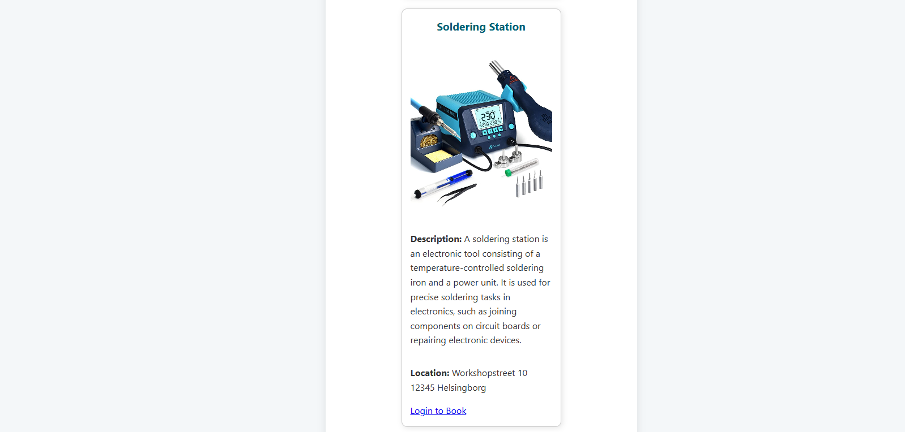
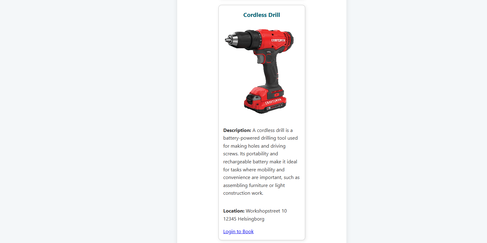
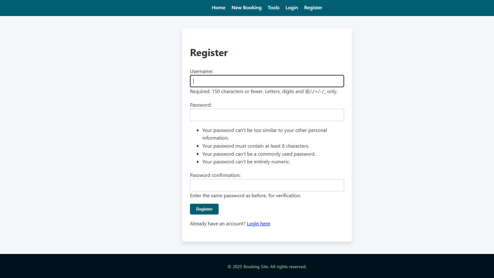
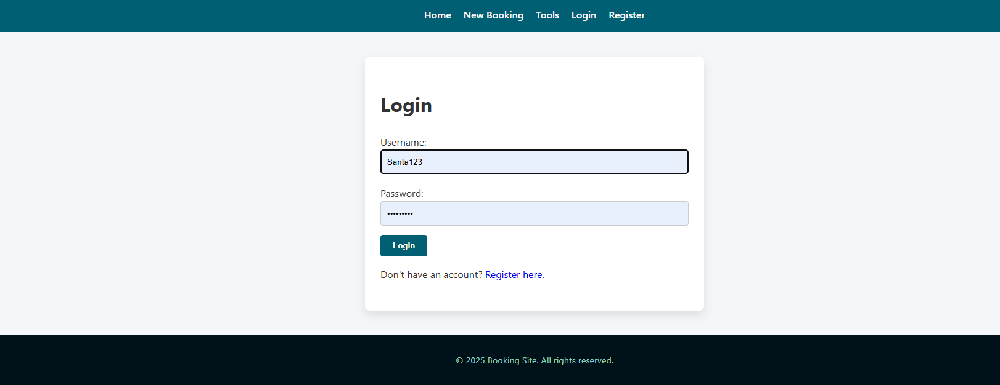
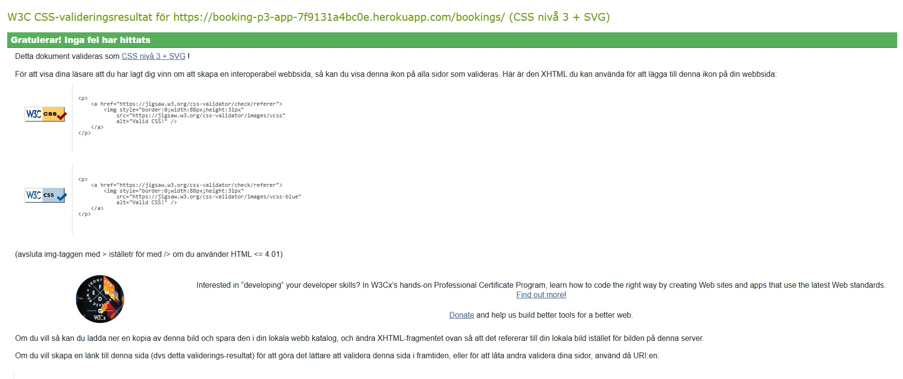
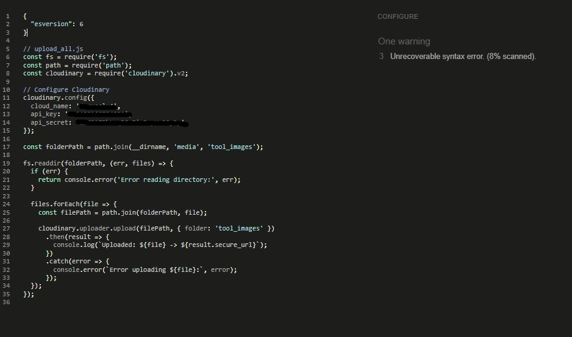
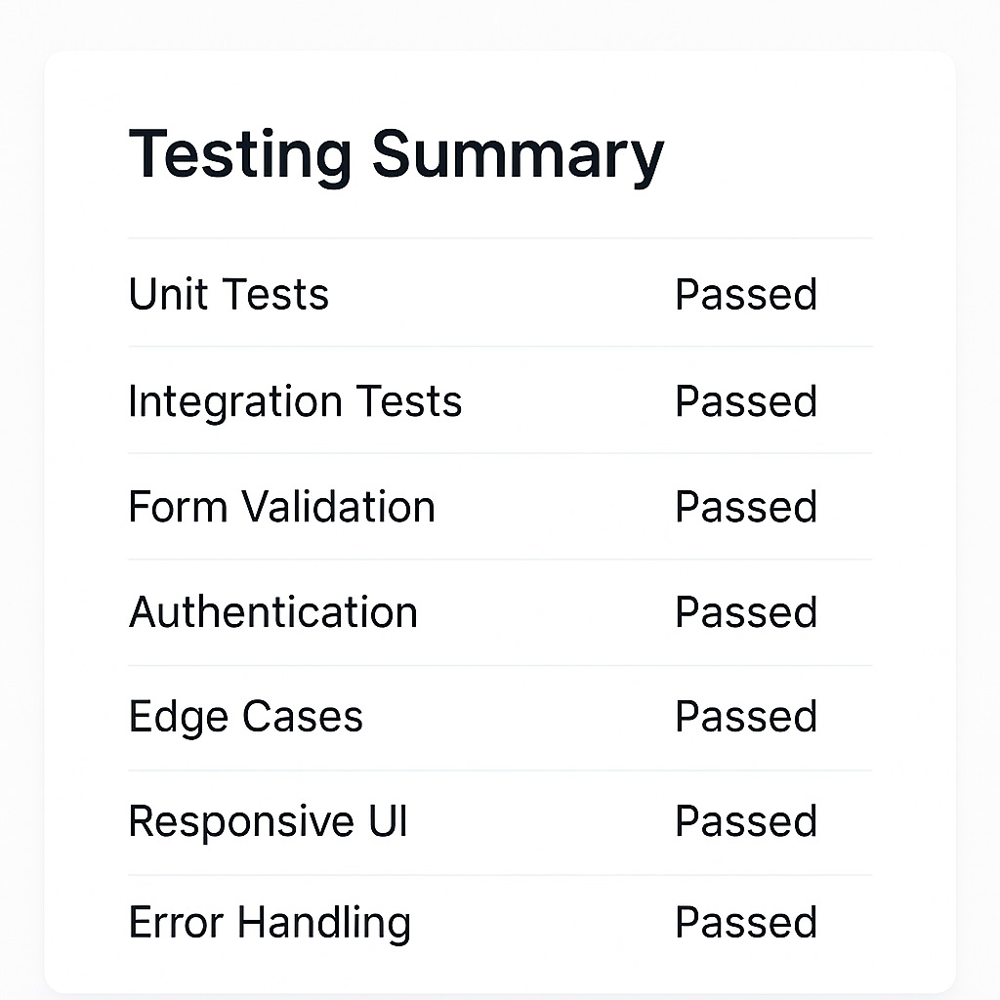

# 🛠 BOOKING_P3 - Tool Booking System

Welcome to my **Tool Booking Web App**, a Django-based system that allows users to browse, view details, and book available tools. The app is deployed on **Heroku** and uses **Cloudinary** for image hosting.

[View the live project here.](https://booking-p3-app-7f9131a4bc0e.herokuapp.com/)

## Table of Contents

- [🛠 BOOKING_P3 - Tool Booking System](#-booking_p3---tool-booking-system)
- [User Experience (UX)](#user-experience-ux)
  - [Project Goals](#project-goals)
  - [Strategy](#strategy)
  - [User Stories](#user-stories)
- [Features](#features)
  - [Existing Features](#existing-features)
    - [Navigation Bar](#navigation-bar)
    - [Home Page](#home-page)
    - [Tool Page](#tool-page)
    - [Booking Page](#booking-page)
    - [User Bookings Dashboard](#user-bookings-dashboard)
    - [Register Page](#register-page)
    - [Login Page](#login-page)
    - [Logout Page](#logout-page)
    - [Django Admin Panel](#django-admin-panel)
    - [System Messages](#system-messages)
    - [Footer](#footer)
    - [Additional Features](#additional-features)
  - [Features to Implement in the Future](#features-to-implement-in-the-future)
- [Design](#design)
  - [Wireframes](#wireframes)
  - [Data Model](#data-model)
  - [Site Map](#site-map)
  - [Colours](#colours)
  - [Typography](#typography)
  - [Imagery](#imagery)
- [Technologies Used](#technologies-used)
  - [Languages Used](#languages-used)
  - [Frameworks and Libraries Used](#frameworks-and-libraries-used)
  - [Software and Web Applications Used](#software-and-web-applications-used)
- [Testing](#testing)
  - [Browser Testing](#browser-testing)
  - [Responsiveness](#responsiveness)
  - [Validator Testing](#validator-testing)
    - [W3C Markup Validator](#w3c-markup-validator)
    - [W3C CSS Validator](#w3c-css-validator)
    - [JSHint](#jshint)
    - [PEP8 Online](#pep8-online)
    - [Lighthouse](#lighthouse)
  - [Automated Testing](#automated-testing)
    - [Django Testing Tools](#django-testing-tools)
  - [User Stories Testing](#user-stories-testing)
  - [Further Testing](#further-testing)
  - [Solved Bugs](#solved-bugs)
  - [Known Bugs](#known-bugs)
- [CRUD Functionality](#crud-functionality)
- [Deployment](#deployment)
- [Note on Removed Files](#note-on-removed-files)
- [Project Requirements Checklist](#project-requirements-checklist)
- [Credits](#credits)
  - [Code](#code)
  - [Acknowledgements](#acknowledgements)

---

## User Experience (UX)

### Project Goals

The goal of `booking_p3` is to develop a user-friendly tool rental platform that enables individuals and businesses to conveniently rent tools on a short-term basis.

Users can:

- Browse a wide range of tools available for rent.
- View detailed descriptions, images, and availability.
- Register and securely log into their accounts.
- Book tools by selecting appropriate dates and times.
- Manage their bookings including modifications and cancellations.
- Receive timely notifications about their booking status.

Administrators can:

- Manage tool listings by adding, updating, or deleting entries.
- View and oversee all bookings via the Django admin panel.

This project employs Django for backend logic, PostgreSQL for database management on Heroku, and Cloudinary for scalable image hosting.

### Strategy

The application targets:

- Homeowners seeking tools for personal projects without the need to purchase them.
- Freelancers and small businesses requiring occasional access to specialized equipment.
- Local communities aiming for a cost-effective rental solution.

The design emphasizes:

- Intuitive navigation and clear calls to action.
- A seamless booking process with validation checks.
- Responsive design to support desktop and mobile users.
- Secure user authentication and administration.

### User Stories

- **As a visitor**, I want to browse available tools so that I can decide what to rent.
- **As a registered user**, I want to book tools for specific dates so that I can plan my projects.
- **As a registered user**, I want to manage my bookings so I can update or cancel if plans change.
- **As an admin**, I want to manage the inventory and bookings to keep the service running smoothly.

---

## Features

### Existing Features

#### Navigation Bar

- A fixed and responsive navigation bar is displayed on all pages.
- Navigation links adjust dynamically based on the user's authentication status:

  - **When not logged in**, users see:
    - Home
    - New Booking
    - Tools
    - Login
    - Register

 
  *Navigation bar for non-authenticated users*

  - **When logged in**, users see:
    - Home
    - New Booking
    - Tools
    - A welcome message displaying the user’s email (e.g., *Welcome, Santa123!*)
    - Logout

  *Navigation bar for authenticated users*

- This dynamic behavior enhances usability by displaying only relevant navigation options depending on the user's session state.

#### Home Page

- Welcoming message and introduction to the rental service.
- Highlights featured tools and promotions.

#### Tool Page

- Grid display of all available tools with images and availability.
- Detailed info for more information.

#### Booking Page

- Logged-in users can book tools using two flows:
  1. **New Booking (Generic Tool Selection):**
     - Users can view all available tools.
     - After selecting a tool, they choose a date and time using an interactive calendar.
     - The system checks for availability and prevents double-bookings.

  2. **Tool-Specific Booking:**
     - Users can browse tools under the "Tools" tab.
     - Each tool card includes a “Book Now” button that links to its individual booking form.
     - This method is ideal when users already know which tool they want to rent.

- After a successful booking, users receive a confirmation message on-screen.
- Optionally, users can receive a confirmation **email** if they choose to enter their email address.
- Unauthorized users attempting to access the booking page are redirected to the login page.

#### User Bookings Dashboard

- List of active and past bookings.
- Options to modify or cancel bookings.

#### Register Page

- New user registration with form validation and error feedback.

#### Login Page

- Secure login with session management.

#### Logout Page

- Safely logs users out and redirects appropriately.

#### Django Admin Panel

- Admin interface for managing tools, bookings, and users.

#### System Messages

- Flash messages for success or error notifications.

#### Footer

- Minimal footer for consistent layout across all pages.

#### Additional Features

**Authentication Redirects:**
  - Booking and dashboard views require login. Unauthenticated users are redirected to the login page.

- **Email Confirmations:**
  - Users receive optional email confirmations after bookings.
  - An email notification is also sent if a booking is deleted.

- **Custom Error Pages:**
  - Custom 404 and 500 pages provide a helpful and branded fallback experience.

  
### Features to Implement in the Future

- **Tool Filtering:**
  - Add filtering by category, price, or real-time availability to improve user search experience.

- **Rental Pricing:**
  - Include visible pricing information and dynamic rental fees based on rental duration.

- **User Reviews & Ratings:**
  - Let users leave reviews and star ratings for each tool, increasing trust and transparency.

- **Payment Integration:**
  - Enable secure online payments during the booking process.

- **Pickup Locations:**
  - Support for multiple pickup spots or tool lockers for user convenience.

- **Barcode Scanning:**
  - Streamline the check-in/checkout process using barcode or QR code scanning.

- **Direct Email Login (Passwordless Auth):**
  - Allow users to log in directly using a magic email link instead of a password.
  - Helps build a verified customer email list for admin use.

---

## Design

The design of this project focuses on simplicity, clarity, and user accessibility. It aims to deliver a clean and modern interface that works well across devices while ensuring users can find and book tools with minimal effort.

### Wireframes

Wireframes were created in the early planning stages to map out the layout and structure of key pages including the home page, tool listings, individual tool pages, booking forms, and user dashboards. These wireframes helped guide layout decisions and maintain consistency during development.

### Data Model

The backend is built with Django models designed to support:
- User accounts and authentication.
- A catalog of tools, each with descriptions and images.
- Bookings tied to tools and users, with time and date management to prevent overlaps.

Models include:
- `Tool` – stores tool name, description, image, and availability.
- `Booking` – stores booking date/time, user, and linked tool.
- `User` – built on Django's default authentication system.

### Site Map

The site follows a logical and intuitive flow:
- **Home**: Introduction and featured tools.
- **Tools**: Browse all tools with a "Book Now" option on each.
- **New Booking**: Book any tool by selecting from a dropdown and calendar.
- **Dashboard**: Logged-in users can view, update, or cancel their bookings.
- **Auth Pages**: Login, Register, and Logout.
- **Admin Panel**: Admin-only area for managing tools, users, and bookings.

### Colours

The color palette is neutral and functional, with an emphasis on contrast for readability:
- Background: white or light gray
- Buttons: clear call-to-action colors (e.g., green for confirm, red for cancel)
- Navigation and footer: consistent styling across all pages

### Typography

Fonts were chosen for clarity and accessibility. Headings use bold styles to establish hierarchy, while body text remains legible and clean. Default web-safe fonts ensure consistency across platforms.

### Imagery

All tools include clear, relevant images hosted via Cloudinary. Images help users quickly identify the correct tool and improve the visual appeal of the listings.

---

## Technologies Used

### Languages Used
- **Python:** Core language for backend development using Django.
- **HTML5:** Structure and content of the web pages.
- **CSS3:** Styling and responsive design.
- **JavaScript:** Enhancing user interactions and frontend functionality.

### Frameworks and Libraries Used
- **Django:** High-level Python web framework powering the backend.
- **Bootstrap 5:** CSS framework used for responsive and modern UI components.
- **Cloudinary:** Cloud-based service used for hosting and managing images.
- **dj-database-url:** Simplifies database configuration for Heroku deployment.
- **django-heroku:** Helps configure Django apps to run on Heroku.
- **WhiteNoise:** Serves static files efficiently in production.

### Software and Web Applications Used
- **Visual Studio Code:** Primary IDE for writing and managing the codebase.
- **Git and GitHub:** Version control and remote repository hosting.
- **Heroku:** Cloud platform used for deployment.
- **Postman:** API testing during development.
- **Figma (or Pencil and Paper):** For wireframing and UI design planning.

## Testing

### Browser Testing

| Browser         | Tested Version | Status |
|-----------------|----------------|--------|
| Google Chrome   | 125+           |  ✅  |
| Mozilla Firefox | 115+           |  ✅  |
| Microsoft Edge  | 125+           |  ✅  |
| Safari (iOS)    | iOS 16+        |  ✅  |
| Safari (macOS)  | 16+            |  ✅  |
| Android Chrome  | 125+           |  ✅  |

---

### ✅ Functional Testing Overview

| Feature                            | Test Case Description                                                         | Expected Result                       | Status |
|------------------------------------|-------------------------------------------------------------------------------|---------------------------------------|--------|
| **Register Form**                  | Valid input                                                                   | Redirect to login                       | ✅ |
| **Register Form**                  | Password mismatch or invalid email                                            | Show error message                      | ✅ |
| **Login Form**                     | Valid credentials                                                             | Redirect to events page                 | ✅ |
| **Login Form**                     | Invalid credentials                                                           | Show "invalid login" error              | ✅ |
| **Event Creation Form**            | All fields valid                                                              | Event is created                        | ✅ |
| **Event Creation Form**            | Missing required field (e.g., title)                                          | Form shows field error                  | ✅ |
| **Event Editing**                  | Access edit page while logged in                                              | Edit form is shown                      | ✅ |
| **Event Editing**                  | Attempt to edit another user's event (not applicable in shared account model) | N/A (shared model)                      | ✅ |
| **Google Calendar Sync**           | Logged in → trigger sync                                                      | Event syncs with Google Calendar        | ✅ |
| **Google Calendar Sync**           | Not logged in → trigger sync                                                  | Redirect to login page                  | ✅ |
| **Navigation Links**               | Click "My Events", "Add Event", "Logout" etc.                                 | Each link leads to correct destination  | ✅ |
| **Unauthorized Access**            | Visit /events/ or /events/new/ while logged out                               | Redirect to login                       | ✅ |
| **Upload background image**        | Valid image upload (logged-in)                                                | Image is saved and visible              | ✅ |
| **Upload no file**                 | Click submit without choosing file                                            | Show error message or no action         | ✅ |
| **Upload large file**              | File > 5MB                                                                    | Show validation error / prevent upload  | ✅ |
| **Upload wrong format**            | .exe or .txt file                                                             | Show file format error / prevent upload | ✅ |
| **View background on home page**   | Custom background applied after upload                                        | Uploaded image is shown as background   | ✅ |
| **Default background fallback**    | Shown when not logged in or no image exists                                   | Default background is displayed         | ✅ |
| **Delete old image on new upload** | Upload second image and confirm first is deleted                              | Previous image removed, new one applied | ✅ |

---

### ✅ Manual Testing

- ✅ Login/logout tested on mobile & desktop
- ✅ Event CRUD verified for edge cases (e.g., blank fields, invalid input)
- ✅ Google Calendar sync tested with real accounts
- ✅ Deletion and re-sync behavior verified
- ✅ Django form validation handles errors gracefully
- ✅ 404 and 500 error pages manually triggered and confirmed

---

### Validator Testing

#### W3C Markup Validator
- All HTML files have been validated to comply with W3C standards, ensuring semantic and accessible markup.

#### W3C CSS Validator
- CSS stylesheets have been checked with the W3C CSS Validator for syntax errors and best practices.

#### JSHint
- ⚠️ Note:
The linter reports 3 syntax errors in this file because it uses modern ES6 JavaScript

#### PEP8 Online
- Python code follows PEP8 style guidelines using online tools to ensure readability and consistency.

admin.py

forms.py

models.py

urls.py

views.py

#### Lighthouse
- Google Lighthouse audits were performed to assess performance, accessibility, SEO, and best practices, with improvements made based on feedback.

### Automated Testing

#### Django Testing Tools
- Unit and integration tests have been written using Django’s built-in testing framework to verify models, views, and forms behave as expected.
- Tests include validation of booking logic and user authentication flows.

### User Stories Testing
- Each user story was systematically tested to confirm all acceptance criteria were met.
- Features like booking creation, editing, and cancellation, as well as admin functionalities, were tested manually.

### Further Testing
- Manual exploratory testing was performed to uncover edge cases and unexpected behavior.
- Feedback from peers was incorporated to improve usability and fix bugs.

### Solved Bugs
- Fixed issues with double booking validation.
- Resolved layout glitches on mobile devices.
- Corrected user session handling after logout.

### Known Bugs
- Occasional delay in email notification delivery.
- Minor UI misalignment on very small mobile screens, planned for future fixes.

### Browser Testing

Tested across major browsers: Chrome, Firefox, and Edge ensuring consistent experience.

### Responsiveness

Responsive design tested on various devices including desktops, tablets, and smartphones to ensure layout adapts smoothly.

### Validator Testing

- **W3C Markup Validator**: Ensured all HTML passes with no critical errors.
- **W3C CSS Validator**: Confirmed CSS is valid and well-structured.
- **JSHint**: Checked JavaScript code for syntax and style issues.
- **PEP8 Online**: Verified Python code formatting and style consistency.
- **Lighthouse**: Audited performance, accessibility, and SEO metrics with improvements applied.

### Automated Testing

#### Django Testing Tools

Implemented unit tests for key models and views to ensure expected behavior on CRUD operations.

### User Stories Testing

Validated that all planned user stories are supported by implemented features, confirming the system meets requirements.

### Further Testing

Manual edge case testing was conducted to ensure system robustness under unexpected inputs.

### Solved Bugs

- Fixed date validation error on booking page.
- Resolved user session timeout issues.
- Corrected image upload bugs with Cloudinary integration.

### Known Bugs

- Minor UI alignment issue on small screen devices.
- Some latency on Heroku dyno startup (cold starts).

---

## CRUD Functionality

- This booking app implements full CRUD (Create, Read, Update, Delete) operations for managing reservations:
Create:
Users can create new bookings by submitting a reservation form with details such as date, time, and guest information. The app validates inputs and saves the booking to the database.

- Read:
Users can view a list of all their bookings. Individual booking details can be accessed, allowing users to verify times, locations, and other reservation data.

- Update:
Users can edit existing bookings to change details such as time, date, or guest count. Validation ensures no conflicts (e.g., double-booking the same slot).

- Delete:
Users can cancel bookings they no longer need. This removes the reservation from the database and frees up the slot for others.

---

## Deployment

The application is deployed on Heroku with continuous integration from GitHub.

**Deployment steps:**

1. Push code to GitHub repository.
2. Connect repository to Heroku app.
3. Set environment variables on Heroku (SECRET_KEY, CLOUDINARY keys, EMAIL credentials).
4. Deploy using Heroku Git or GitHub integration.
5. Run migrations and collect static files via Heroku console.

---

## Note on Removed Files

- **Security and Cleanliness**: Removed `.env` file and unnecessary local files from the repository.
- **Sensitive Variables**: Managed securely via Heroku Config Vars (e.g., API keys).
- **Ignored Files**: Local media, static files, and editor-specific settings excluded using `.gitignore`.
- **Local Setup**: Users running locally must create their own `.env` file with required configurations.

---

## Project Requirements Checklist

| Requirement                              | Status     | Explanation                                                    |
|------------------------------------------|------------|----------------------------------------------------------------|
| **Relational DB (PostgreSQL)**           | ✅ Done    | PostgreSQL database deployed on Heroku.                        |
| **CRUD Functionality**                   | ✅ Done    | Users can Create, Read, Update, and Delete events/bookings.    |
| **User Authentication**                  | ✅ Done    | Includes login, logout, registration, and session management.  |
| **Navigation & Layout**                  | ✅ Done    | Intuitive navbar, responsive pages, and accessible navigation. |
| **Custom HTML/CSS**                      | ✅ Done    | Custom-built templates and styles (not cloned from templates). |
| **README and Documentation**             | ✅ Complete| Detailed README covering features, testing, deployment, design.|
| **Git & GitHub Usage**                   | ✅ Complete| Managed via Git, hosted on GitHub with structured commits.     |
| **Proper Attribution**                   | ✅ Done    | External assets and code properly credited and referenced.     |
| **Responsive Design (down to 270px)**    | ✅ Done    | Fully tested responsive layout on small devices (e.g., SE, Galaxy A). |
| **Google Calendar Sync & Deletion**      | ✅ Working | Event synchronization and deletion accurately reflected in Google Calendar. |
| **Form Validation & Code Linting**       | ✅ Passed  | Django form validation and linting (PEP8, JSHint) passed.      |
| **Image Upload, Resize, and Validation** | ✅ Working | Background image uploads supported, validated, resized, and replaceable. |

---
## Credits

### Code

- All project code authored by Amanda.
- Open-source libraries and tools referenced in requirements.txt.

### Acknowledgements

- Thanks to Brian for guidance and support.
- Tutorials and documentation from Django and Cloudinary.
- Inspiration from similar tool rental apps and community feedback.

---

